# capa Rule Generation Agent

An autonomous agent that processes the [capa-rules](https://github.com/mandiant/capa-rules) issue backlog — generating, validating, and submitting rules with a **multi-layered quality gate** that operates even when no reference sample is available. Built as a GSoC 2026 proposal demonstrator for Mandiant FLARE.

[](https://github.com/reyyanxahmed/capa-rule-agent/actions)


> **Primary focus**: Automate the capa-rules issue backlog — transitioning behavioral descriptions and sample references into validated, submission-ready rules.
>
> **Key challenge solved**: How does the agent ensure generated rule quality when **no representative sample is provided**? → A 5-layer quality gate with confidence-based routing and structured HITL metadata.

## System Architecture

```mermaid
flowchart TB
    subgraph Input ["📥 Issue Backlog"]
        direction LR
        BL["🗂️ Backlog Processor\n`backlog.py`\nFetch · classify · prioritize\nopen capa-rules issues"]
        T1["🐛 Issue Parser\n`trigger.py`\nParse issue →\nIssueContext"]
    end

    subgraph Grounding ["🔍 Grounding Layer"]
        direction LR
        G1["📚 RAG Index\n`grounding.py`\n650+ capa rules indexed\nby namespace · ATT&CK · keyword"]
        G2["🌐 Search Grounding\n`search_grounding.py`\nMSDN · ATT&CK\nverification"]
    end

    subgraph Core ["⚙️ Generation"]
        GEN["✏️ Generator\n`generator.py`\nGemini 2.0 Flash\n+ grounding context"]
    end

    subgraph Validation ["🛡️ Validation Loop"]
        direction LR
        V1["📄 YAML Syntax"]
        V2["📋 Schema"]
        V3["🔍 capa Lint"]
        V4["🎨 capafmt"]
        V1 --> V2 --> V3 --> V4
    end

    subgraph QualityGate ["🔬 Quality Gate (5 Layers)"]
        direction TB
        L1["Layer 1: Structural\nYAML · schema · lint"]
        L2["Layer 2: Sibling Analysis\nFeature overlap with\nnamespace siblings"]
        L3["Layer 3: Negative Testing\nRun against benign PEs\nfrom capa-testfiles"]
        L4["Layer 4: Semantic Coherence\nName ↔ features · ATT&CK\n↔ namespace alignment"]
        L5["Layer 5: Confidence Routing\nHIGH → rules/\nMEDIUM → nursery/\nREJECT → blocked"]
        L1 --> L2 --> L3 --> L4 --> L5
    end

    subgraph Output ["📤 Output"]
        direction LR
        O1["📝 Validated Rule\n+ HITL metadata table"]
        O2["🔀 Pull Request\n`pr_workflow.py`\nConfidence-routed\nto rules/ or nursery/"]
    end

    %% Flow
    BL -->|"prioritized issues"| T1
    T1 --> G1
    T1 --> G2
    G1 -->|"top-K similar rules"| GEN
    G2 -->|"API docs"| GEN
    GEN --> V1
    V3 -- "❌ errors" --> GEN
    V4 --> L1
    L5 -- "✅ MEDIUM+" --> O1
    L5 -- "❌ REJECT" --> GEN
    O1 --> O2

    %% Styling
    style Input fill:#1a1a2e,stroke:#e94560,stroke-width:2px,color:#eee
    style Grounding fill:#16213e,stroke:#0f3460,stroke-width:2px,color:#eee
    style Core fill:#1a1a2e,stroke:#e94560,stroke-width:2px,color:#eee
    style Validation fill:#0f3460,stroke:#53a8b6,stroke-width:2px,color:#eee
    style QualityGate fill:#2d1b4e,stroke:#e94560,stroke-width:3px,color:#eee
    style Output fill:#16213e,stroke:#53a8b6,stroke-width:2px,color:#eee

    style BL fill:#0f3460,stroke:#e94560,color:#eee
    style T1 fill:#0f3460,stroke:#53a8b6,color:#eee
    style G1 fill:#1a1a2e,stroke:#e94560,color:#eee
    style G2 fill:#1a1a2e,stroke:#e94560,color:#eee
    style GEN fill:#533483,stroke:#e94560,stroke-width:2px,color:#eee
    style V1 fill:#0f3460,stroke:#53a8b6,color:#eee
    style V2 fill:#0f3460,stroke:#53a8b6,color:#eee
    style V3 fill:#0f3460,stroke:#53a8b6,color:#eee
    style V4 fill:#0f3460,stroke:#53a8b6,color:#eee
    style L1 fill:#3d1f6d,stroke:#e94560,color:#eee
    style L2 fill:#3d1f6d,stroke:#e94560,color:#eee
    style L3 fill:#3d1f6d,stroke:#e94560,color:#eee
    style L4 fill:#3d1f6d,stroke:#e94560,color:#eee
    style L5 fill:#3d1f6d,stroke:#e94560,color:#eee
    style O1 fill:#1a1a2e,stroke:#53a8b6,color:#eee
    style O2 fill:#1a1a2e,stroke:#53a8b6,color:#eee
```



---

## The No-Sample Quality Gate

> *"How does the agent ensure the generated rule matches as expected and maintains high quality when no representative sample is provided?"* — [mike-hunhoff](https://github.com/mandiant/flare-gsoc/discussions/89)

This is the core technical challenge. Most capa-rules issues describe desired behavior without providing a binary to test against. The quality gate provides **multi-layered validation that doesn't require a sample**:

### 5-Layer Architecture

| Layer | Check | What It Verifies | Sample Required? |
|-------|-------|-------------------|:---:|
| **1. Structural** | YAML parse, schema match, capa lint, capafmt | Rule is well-formed and passes official tooling | No |
| **2. Sibling Analysis** | Feature overlap with rules in the same namespace | Detects over-generalization (like [#1100](https://github.com/mandiant/capa-rules/issues/1100)) and under-specification | No |
| **3. Negative Testing** | Run capa with generated rule against known-benign PEs from `capa-testfiles` | Catches false positives — if the rule matches `notepad.exe`, it's too broad | No |
| **4. Semantic Coherence** | Name↔feature alignment, ATT&CK↔namespace consistency, API validity, logic tree depth | Ensures the rule *means what it says* | No |
| **5. Sample Testing** | Run capa against reference binary (if provided in issue) | Ground truth confirmation | **Yes** |

### Confidence Routing

The quality gate computes a confidence level that determines where the rule lands:

```
┌─────────────────────────────────────────────────────┐
│  All 5 layers pass + sample tested     → HIGH       │  → rules/
│  All layers pass, no sample available  → MEDIUM     │  → nursery/
│  Any non-structural layer fails        → LOW        │  → needs review
│  Structural or semantic layer fails    → REJECT     │  → blocked
└─────────────────────────────────────────────────────┘
```

- **HIGH** → rule goes directly to `rules/` directory (production-ready)
- **MEDIUM** → rule goes to `nursery/` (valid but unverified against real malware)
- **LOW** → submitted with review flag; PR body explains what failed
- **REJECT** → not submitted; agent attempts self-correction

The `nursery/` directory is capa's built-in staging area for rules that are structurally valid but haven't been confirmed against a representative sample — making it the natural home for agent-generated rules without ground truth.

### Sibling Analysis: Catching Over-Generalization

Layer 2 solves a real problem: [issue #1100](https://github.com/mandiant/capa-rules/issues/1100) was a false positive in `persist-via-windows-service` because the rule was too broad. The sibling analyzer:

1. Finds all rules in the same namespace (e.g., `persistence/service/`)
2. Extracts feature sets from each sibling rule
3. Computes feature uniqueness — what percentage of the new rule's features are unique to it?
4. Flags **over-generalization risk** when < 20% of features are unique (the rule likely matches everything its siblings already match)

```python
# Example: analyzing a new "persist via windows service" rule
siblings = analyze_siblings(new_rule, rules_dir="capa-rules/")
# → over_generalization_risk: True (only 15% unique features)
# → detail: "Rule shares 85% of features with 'persist via Windows service'"
```

### Negative Testing: Known-Benign Baseline

Layer 3 runs the generated rule against benign PE files from `capa-testfiles`:

```
$ capa --rules /tmp/new_rule.yml capa-testfiles/benign/notepad.exe
→ 0 matches (PASS — rule does not flag benign software)

$ capa --rules /tmp/new_rule.yml capa-testfiles/benign/cmd.exe
→ 1 match  (FAIL — false positive detected!)
```

If the rule matches *any* benign binary, the quality gate reports a failure with the specific file that matched and the confidence drops.

---

## HITL Metadata: What Was (and Wasn't) Verified

Every PR includes a structured verification report so human reviewers know exactly what the agent checked:

```markdown
## Quality Gate Results

**Confidence: MEDIUM** — Rule structurally valid; no reference sample available for ground truth testing.
**Target directory: `nursery/`**

### Verification Summary

| Layer | Check | Status | Detail |
|-------|-------|--------|--------|
| Structural | YAML syntax | ✅ PASSED | Valid YAML |
| Structural | Schema validation | ✅ PASSED | All required fields present |
| Structural | capa lint | ✅ PASSED | 0 errors |
| Sibling | Feature overlap | ✅ PASSED | 67% unique features (3 siblings compared) |
| Sibling | Over-generalization | ✅ PASSED | Sufficient feature differentiation |
| Negative | notepad.exe | ✅ PASSED | 0 matches |
| Negative | cmd.exe | ✅ PASSED | 0 matches |
| Semantic | Feature depth | ✅ PASSED | 4 features (min: 2) |
| Semantic | Name↔features | ✅ PASSED | Rule name aligns with feature set |
| Semantic | ATT&CK↔namespace | ✅ PASSED | T1543.003 consistent with persistence/ |
| Sample | Binary test | ⏭️ SKIPPED | No reference sample provided |

<details>
<summary>What was NOT verified (and why)</summary>

- **Sample-based testing**: No reference binary was provided in the issue or
  discoverable via linked references. The rule has not been confirmed to match
  any real malware sample.
- **Runtime behavior**: Dynamic analysis was not performed. Rules relying on
  `dynamic` scope features have not been validated against sandbox traces.
</details>
```

This gives maintainers a clear picture: they can see exactly which checks passed, which were skipped, and *why* — enabling informed review decisions without re-running the entire validation pipeline.

---

## Issue Backlog Processing

The agent's primary input is the capa-rules issue backlog. The backlog processor classifies each issue by tractability:

### Issue Classification

| Tractability | Criteria | What the Agent Can Do |
|-------------|----------|----------------------|
| **HIGH** | Issue contains a SHA256 hash or sample reference | Full pipeline: generate → validate → test against sample → submit to `rules/` |
| **MEDIUM** | Decompiled code, IOCs (registry paths, IPs), or ATT&CK IDs | Generate with grounding → validate → quality gate → submit to `nursery/` |
| **LOW** | Behavioral description only | Template generation → structural validation → submit with review flag |
| **SKIP** | Bug report, already has a linked PR, or meta-discussion | Skip — not a rule request |

### Batch Processing

```bash
# Process the top 5 highest-tractability issues
python -m src.pipeline --process-backlog --backlog-batch 5 --rules-dir ../capa-rules

# Output:
# ════════════════════════════════════════════════
# BACKLOG ANALYSIS: 47 open issues
# ════════════════════════════════════════════════
#   HIGH tractability:   8 issues (sample available)
#   MEDIUM tractability: 23 issues (IOCs/decompilation)
#   LOW tractability:    12 issues (behavioral only)
#   SKIP:                4 issues (bugs/existing PRs)
#
# Processing batch of 5 (HIGH priority first)...
#   [1/5] #1114: persist via ShellServiceObjectDelayLoad → MEDIUM confidence → nursery/
#   [2/5] #1098: detect BITS transfer job abuse        → HIGH confidence → rules/
#   ...
```

---

## Pipeline Stages

```
Stage 1: Issue Parsing        → Extract IssueContext (ATT&CK IDs, hashes, refs, decompilation)
Stage 2: RAG Grounding        → Index 650+ rules, retrieve top-5 similar as few-shot examples
Stage 3: Search Grounding     → Google Search for API docs + ATT&CK technique details
Stage 4: LLM Generation       → Gemini 2.0 Flash with dual grounding context
Stage 5: Validation            → YAML → Schema → capa lint → capafmt
Stage 6: Self-Correction       → Parse errors, re-prompt LLM (up to 3 attempts)
Stage 7: Quality Gate          → 5-layer verification + confidence scoring
Stage 8: PR Submission         → Confidence-routed to rules/ or nursery/ with HITL metadata
```

## Agent Tool-Use Architecture (ADK Mode)

The ADK agent wraps each pipeline stage as a discrete tool that Gemini invokes via function calling:

| Tool | Purpose | Maps To |
|------|---------|---------|
| `parse_issue` | Extract structured context from a GitHub issue URL | `trigger.py` |
| `search_similar_rules` | RAG retrieval over capa-rules corpus | `grounding.py` |
| `search_api_docs` | Google Search for Win32 API / ATT&CK verification | `search_grounding.py` |
| `generate_rule` | Generate a capa rule with grounding context | `generator.py` |
| `validate_rule` | Full YAML → schema → lint → format pipeline | `validator.py` |
| `run_capa_test` | Run capa on a real sample to verify detection | `test_runner.py` |
| `run_quality_gate` | 5-layer quality gate with confidence scoring | `quality_gate.py` |
| `create_pr` | Submit validated rule as a Pull Request | `pr_workflow.py` |

The agent selects a different tool chain depending on context:

```
── With sample (HIGH tractability) ──
parse_issue → search_similar_rules → generate_rule → validate_rule
  → run_capa_test → run_quality_gate → create_pr (→ rules/)

── Without sample (MEDIUM tractability) ──
parse_issue → search_similar_rules → search_api_docs → generate_rule
  → validate_rule → run_quality_gate → create_pr (→ nursery/)
```

## Components

| Module | File | Description |
|--------|------|-------------|
| **Backlog Processor** | `src/backlog.py` | Fetches, classifies, and prioritizes open capa-rules issues by tractability |
| **Quality Gate** | `src/quality_gate.py` | 5-layer validation with confidence scoring and HITL metadata generation |
| **Issue Parser** | `src/trigger.py` | Parses capa-rules GitHub issues → structured `IssueContext` |
| **RAG Grounding** | `src/grounding.py` | Inverted index over 650+ capa rules; retrieves top-K by namespace/ATT&CK/keyword |
| **Search Grounding** | `src/search_grounding.py` | Google Search for MSDN API docs, registry paths, ATT&CK technique details |
| **Generator** | `src/generator.py` | Gemini 2.0 Flash with system prompt + few-shot examples + grounding context |
| **Validator** | `src/validator.py` | Multi-stage: YAML syntax → schema → `capa lint` → `capafmt` |
| **Test Runner** | `src/test_runner.py` | Run capa on real samples (local or MalwareBazaar download) |
| **PR Workflow** | `src/pr_workflow.py` | Confidence-routed PR creation with HITL metadata table |
| **ADK Agent** | `src/adk_agent.py` | Google ADK agent with 8 tool declarations and agentic reasoning loop |
| **Pipeline** | `src/pipeline.py` | Orchestrator — offline, standard, agent, and backlog modes |

## Quick Start

```bash
# Clone with capa-rules for grounding and sibling analysis
git clone https://github.com/mandiant/capa-rules.git ../capa-rules

# Install dependencies
pip install -r requirements.txt
export GOOGLE_API_KEY="your-key-here"

# ── Process a single issue ──
python -m src.pipeline --issue-url https://github.com/mandiant/capa-rules/issues/1114

# ── Batch process the backlog ──
python -m src.pipeline --process-backlog --backlog-batch 5 --rules-dir ../capa-rules

# ── Offline mode (no API, template generation) ──
python -m src.pipeline --description "Detect persistence via ShellServiceObjectDelayLoad" --offline

# ── ADK Agent mode (autonomous tool-use reasoning) ──
python -m src.pipeline --agent --issue-url https://github.com/mandiant/capa-rules/issues/1114

# ── Full pipeline with sample testing + PR submission ──
python -m src.pipeline --issue-url https://github.com/mandiant/capa-rules/issues/1114 \
  --submit-pr --sample-dir ./samples/ --testfiles-dir ../capa-testfiles/
```

## Testing

```bash
# Run all 119 tests
python -m pytest tests/ -v

# Quality gate tests (49 tests)
python -m pytest tests/test_quality_gate.py -v

# Unit tests (trigger, validator, generator, grounding)
python -m pytest tests/test_agent.py -v

# Expanded module tests (ADK, search, PR, test runner)
python -m pytest tests/test_expanded.py -v

# Integration tests (requires capa-rules clone at ../capa-rules)
python -m pytest tests/test_integration.py -v
```

## Project Structure

```
capa-rule-agent/
├── src/
│   ├── __init__.py
│   ├── __main__.py            # CLI entry: python -m src
│   ├── pipeline.py             # Orchestrator — offline, standard, agent, backlog modes
│   ├── backlog.py              # Issue backlog processor — fetch, classify, prioritize
│   ├── quality_gate.py         # 5-layer quality gate — confidence scoring + HITL metadata
│   ├── trigger.py              # Issue parser — GitHub issues → IssueContext
│   ├── grounding.py            # RAG index over 650+ capa rules
│   ├── search_grounding.py     # Google Search for API/ATT&CK verification
│   ├── generator.py            # Gemini-powered rule generation
│   ├── validator.py            # YAML → schema → lint → format validation
│   ├── test_runner.py          # capa execution against real samples
│   ├── pr_workflow.py          # Confidence-routed PR creation
│   └── adk_agent.py            # Google ADK agent with 8 tools
├── tests/
│   ├── test_quality_gate.py    # Quality gate + backlog tests (49 tests)
│   ├── test_agent.py           # Unit tests (27 tests)
│   ├── test_expanded.py        # Expanded module tests (35 tests)
│   └── test_integration.py     # Integration tests (8 tests)
├── examples/
│   ├── shellserviceobjectdelayload.yml
│   └── detect-bits-usage.yml
├── .github/workflows/ci.yml    # CI with Python 3.11/3.12 matrix
├── requirements.txt
└── README.md
```

## How It Works

1. **Backlog Intake** — Fetch open capa-rules issues, classify by tractability (HIGH/MEDIUM/LOW/SKIP), prioritize batch
2. **Issue Parsing** — Extract ATT&CK IDs, sample hashes, decompilation snippets, references, behavioral description
3. **RAG Grounding** — Index 650+ existing capa rules → retrieve top-K most similar as few-shot examples
4. **Search Grounding** — Google Search to verify Win32 API names, registry paths, ATT&CK technique details
5. **Generate** — Prompt Gemini 2.0 Flash with system instruction + RAG examples + search context + issue details
6. **Validate** — Run `capa lint` and `capafmt`; self-correct up to 3 attempts on failure
7. **Quality Gate** — 5-layer verification: structural → sibling analysis → negative testing → semantic coherence → confidence scoring
8. **Submit PR** — Route to `rules/` (HIGH) or `nursery/` (MEDIUM) with structured HITL metadata table

## Tech Stack

- **LLM**: Gemini 2.0 Flash (via `google-genai` SDK)
- **Agent Framework**: Google ADK with function calling (8 tools)
- **RAG**: Custom inverted index (namespace, ATT&CK, keyword)
- **Search**: Google Custom Search API with MSDN/ATT&CK targeting
- **Validation**: capa's official `lint.py` + `capafmt.py`
- **Quality Gate**: 5-layer verification with confidence routing
- **Testing**: capa CLI + negative testing against `capa-testfiles` benign PEs
- **PR Automation**: GitHub CLI (`gh`) with HITL metadata table
- **CI**: GitHub Actions with Python 3.11/3.12 matrix
