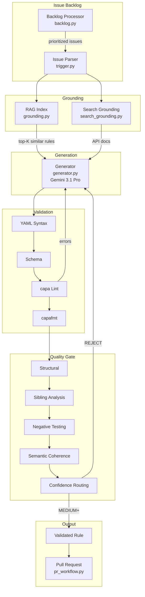

# capa Rule Generation Agent

PoC for GSoC 2026 — Mandiant FLARE's "Automated Rule Generation Agent" project. Takes a [capa-rules](https://github.com/mandiant/capa-rules) GitHub issue, generates a candidate rule using Gemini 3.1 Pro with RAG grounding from the existing rule corpus, validates it against capa's linter/formatter, and runs it through a quality gate that scores confidence even when no reference sample is available. Issue parsing, RAG grounding, LLM generation, validation, and the quality gate are implemented and tested. ADK agent orchestration, PR submission, and search grounding are scaffolded but not yet end-to-end functional.

## Status

- [x] Issue parsing — extracts ATT&CK IDs, sample hashes, decompilation, references from GitHub issues
- [x] RAG grounding — inverted index over 650+ capa rules, top-K retrieval by namespace/ATT&CK/keyword
- [x] LLM generation — Gemini 3.1 Pro with system prompt, few-shot examples from RAG, grounding context
- [x] Validation loop — YAML syntax, schema check, `capa lint`, `capafmt`, self-correction up to 3 attempts
- [x] Quality gate — 5-layer scoring (structural, sibling analysis, negative testing, semantic coherence, sample testing)
- [x] Backlog processor — fetches/classifies open issues by tractability (HIGH/MEDIUM/LOW/SKIP)
- [x] Offline mode — template generation without API calls, useful for testing
- [ ] ADK agent mode — tool declarations exist, orchestration loop scaffolded, not tested end-to-end
- [ ] PR submission — `pr_workflow.py` scaffolded, not tested against real repos
- [ ] Search grounding — Google Search for API docs/ATT&CK verification, stubbed
- [ ] Integration with capa CI — planned
- [ ] Full backlog automation — planned

## Architecture



## Quality Gate

Most capa-rules issues describe desired behavior without providing a binary to test against. The quality gate provides multi-layered validation that doesn't require a sample:

| Layer | Check | What It Verifies | Sample Required? |
|-------|-------|-------------------|:---:|
| 1. Structural | YAML parse, schema match, capa lint, capafmt | Rule is well-formed and passes official tooling | No |
| 2. Sibling Analysis | Feature overlap with rules in the same namespace | Detects over-generalization and under-specification | No |
| 3. Negative Testing | Run capa against known-benign PEs from `capa-testfiles` | Catches false positives | No |
| 4. Semantic Coherence | Name/feature alignment, ATT&CK/namespace consistency, logic tree depth | Rule means what it says | No |
| 5. Sample Testing | Run capa against reference binary (if provided) | Ground truth confirmation | Yes |

Confidence is computed from layer results: all pass + sample tested = HIGH (route to `rules/`), all pass without sample = MEDIUM (route to `nursery/`), any non-structural failure = LOW, structural or semantic failure = REJECT.

## Modules

| Module | File | Description |
|--------|------|-------------|
| Issue Parser | `src/trigger.py` | GitHub issue to structured `IssueContext` (ATT&CK IDs, hashes, refs) |
| RAG Grounding | `src/grounding.py` | Inverted index over capa rules corpus, top-K retrieval |
| Generator | `src/generator.py` | Gemini 3.1 Pro rule generation with few-shot examples |
| Validator | `src/validator.py` | YAML, schema, `capa lint`, `capafmt` |
| Quality Gate | `src/quality_gate.py` | 5-layer confidence scoring, HITL metadata for PR bodies |
| Backlog Processor | `src/backlog.py` | Fetch/classify open issues by tractability |
| Test Runner | `src/test_runner.py` | Run capa against samples (scaffolded) |
| Search Grounding | `src/search_grounding.py` | Google Search for API/ATT&CK verification (stubbed) |
| PR Workflow | `src/pr_workflow.py` | Branch, commit, PR creation via `gh` (scaffolded) |
| ADK Agent | `src/adk_agent.py` | Gemini function-calling agent with 8 tools (scaffolded) |
| Pipeline | `src/pipeline.py` | Orchestrator, CLI entry point |

## Quick Start

```bash
# Clone capa-rules for RAG grounding and sibling analysis
git clone https://github.com/mandiant/capa-rules.git ../capa-rules
pip install -r requirements.txt

# Generate a rule from a description (offline, no API key needed)
python -m src.pipeline --description "Detect persistence via ShellServiceObjectDelayLoad" --offline

# Generate from a GitHub issue (requires GOOGLE_API_KEY)
export GOOGLE_API_KEY="your-key"
python -m src.pipeline --issue-url https://github.com/mandiant/capa-rules/issues/1114
```

## Testing

```bash
python -m pytest tests/ -v
```

| File | Description |
|------|-------------|
| `tests/test_agent.py` | Unit tests for trigger, validator, generator, grounding |
| `tests/test_expanded.py` | Tests for ADK agent, search grounding, PR workflow, test runner |
| `tests/test_quality_gate.py` | Quality gate, backlog processor, confidence routing |
| `tests/test_integration.py` | Integration tests (requires `capa-rules` clone at `../capa-rules`) |

## Project Structure

```
capa-rule-agent/
├── src/
│   ├── __init__.py
│   ├── __main__.py            # CLI entry: python -m src
│   ├── pipeline.py             # Orchestrator — offline, standard, agent, backlog modes
│   ├── backlog.py              # Issue backlog processor — fetch, classify, prioritize
│   ├── quality_gate.py         # 5-layer quality gate — confidence scoring + HITL metadata
│   ├── trigger.py              # Issue parser — GitHub issues → IssueContext
│   ├── grounding.py            # RAG index over 650+ capa rules
│   ├── search_grounding.py     # Google Search for API/ATT&CK verification
│   ├── generator.py            # Gemini-powered rule generation
│   ├── validator.py            # YAML → schema → lint → format validation
│   ├── test_runner.py          # capa execution against real samples
│   ├── pr_workflow.py          # Confidence-routed PR creation
│   └── adk_agent.py            # Google ADK agent with 8 tools
├── tests/
│   ├── test_quality_gate.py    # Quality gate + backlog tests (49 tests)
│   ├── test_agent.py           # Unit tests (27 tests)
│   ├── test_expanded.py        # Expanded module tests (35 tests)
│   └── test_integration.py     # Integration tests (8 tests)
├── examples/
│   ├── shellserviceobjectdelayload.yml
│   └── detect-bits-usage.yml
├── .github/workflows/ci.yml    # CI with Python 3.11/3.12 matrix
├── requirements.txt
└── README.md
```
