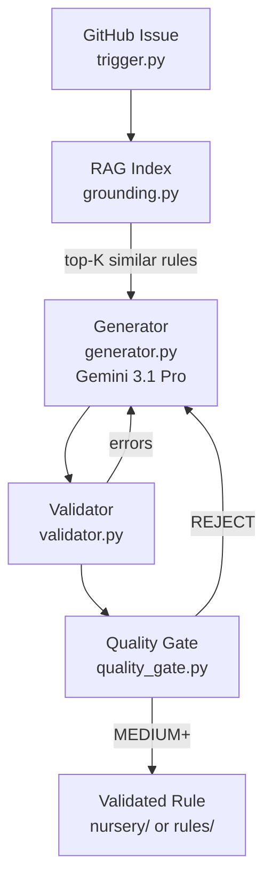

# capa Rule Generation Agent

PoC for GSoC 2026 Project #2: "Automated Rule Generation Agent" under Mandiant FLARE. Takes a [capa-rules](https://github.com/mandiant/capa-rules) GitHub issue, generates a candidate rule using Gemini 3.1 Pro with RAG grounding over the existing rule corpus, validates it against capa's linter and formatter, and scores confidence through a multi-layered quality gate. The quality gate is designed for the common case where no reference binary is available.

## Status

- [x] Issue parsing (ATT&CK IDs, sample hashes, decompilation, references)
- [x] RAG grounding (inverted index over 650+ capa rules, top-K retrieval)
- [x] LLM generation (Gemini 3.1 Pro with grounding context and self-correction)
- [x] Validation loop (YAML syntax, schema, capa lint, capafmt, up to 3 retries)
- [x] Quality gate (5-layer scoring without requiring a sample binary)
- [x] Offline mode (template generation without API calls, for testing)
- [ ] PR submission (scaffolded in pr_workflow.py, not tested against real repos)
- [ ] Sample-based testing (scaffolded in test_runner.py, needs local binaries)
- [ ] Integration with capa CI

## Architecture



## Quality Gate

Most capa-rules issues describe desired behavior without providing a binary. The quality gate validates rules without one:

| Layer | What It Checks | Sample Required? |
|-------|----------------|:---:|
| 1. Structural | YAML parse, schema, capa lint, capafmt | No |
| 2. Sibling Analysis | Feature overlap with rules in same namespace | No |
| 3. Negative Testing | Run against known-benign PEs from capa-testfiles | No |
| 4. Semantic Coherence | Name/feature alignment, ATT&CK consistency, logic tree | No |
| 5. Sample Testing | Run capa against reference binary (if provided) | Yes |

Confidence routing: all pass + sample = HIGH (rules/), all pass without sample = MEDIUM (nursery/), structural or semantic failure = REJECT. Thresholds are documented in quality_gate.py with comments explaining they are heuristics, not empirically tuned.

## Examples

End-to-end outputs generated by Gemini 3.1 Pro against real open capa-rules issues:

| Directory | Issue | Confidence | Shows |
|-----------|-------|:---:|-------|
| [issue-1095](examples/issue-1095-shellcode-via-readdirectorychanges/) | [#1095](https://github.com/mandiant/capa-rules/issues/1095) shellcode via ReadDirectoryChanges | MEDIUM | Strongest rule: specific API combo, correct ATT&CK |
| [issue-1048](examples/issue-1048-ransomware-service-termination/) | [#1048](https://github.com/mandiant/capa-rules/issues/1048) ransomware service termination | MEDIUM | Semantic grouping of service names |
| [issue-967](examples/issue-967-detect-bits-usage/) | [#967](https://github.com/mandiant/capa-rules/issues/967) detect BITS usage | MEDIUM | COM CLSIDs as byte patterns |
| [issue-1100](examples/issue-1100-persist-via-windows-service/) | [#1100](https://github.com/mandiant/capa-rules/issues/1100) persist via Windows service (FP) | LOW | Sibling overlap flagged by quality gate |
| [issue-1041](examples/issue-1041-systemctl-interaction/) | [#1041](https://github.com/mandiant/capa-rules/issues/1041) systemctl/journalctl on Linux | LOW | Self-correction loop (string too short) |
| [issue-915](examples/issue-915-delay-execution-beep/) | [#915](https://github.com/mandiant/capa-rules/issues/915) delay execution via Beep | LOW | Self-correction loop (MBC format) |
| [issue-1050](examples/issue-1050-mouse-movement-sandbox-evasion/) | [#1050](https://github.com/mandiant/capa-rules/issues/1050) mouse movement sandbox evasion | LOW | Three detection variants |
| [issue-971](examples/issue-971-detect-socks5-proxy/) | [#971](https://github.com/mandiant/capa-rules/issues/971) SOCKS5 proxy capabilities | LOW | Protocol constant detection |

Each example contains `input.json`, `generated_rule.yml` (actual Gemini output), `quality_report.md`, and a README with honest assessment of the result.

## Quick Start

```bash
git clone https://github.com/mandiant/capa-rules.git ../capa-rules
pip install -r requirements.txt
python -m src.pipeline --description "Detect persistence via Run registry key T1547.001" --offline
```

## Testing

```bash
python -m pytest tests/ -v
# 98 tests, ~2s
```

## Project Structure

```
capa-rule-agent/
├── src/
│   ├── pipeline.py         # CLI + orchestrator (single execution path)
│   ├── trigger.py          # GitHub issue to IssueContext
│   ├── grounding.py        # RAG index over capa-rules corpus
│   ├── generator.py        # Gemini 3.1 Pro rule generation
│   ├── validator.py        # YAML, schema, lint, format
│   ├── quality_gate.py     # 5-layer confidence scoring
│   ├── test_runner.py      # capa execution against samples (scaffolded)
│   └── pr_workflow.py      # PR creation via gh CLI (scaffolded)
├── future/                  # Modules not yet end-to-end tested
│   ├── adk_agent.py        # Google ADK agent (scaffolded)
│   ├── backlog.py          # Issue backlog classifier
│   ├── proactive.py        # Threat intel feed scanner
│   └── search_grounding.py # Google Search API stubs
├── examples/                # End-to-end outputs for real issues
├── tests/                   # 98 tests (unit + integration)
└── requirements.txt
```
