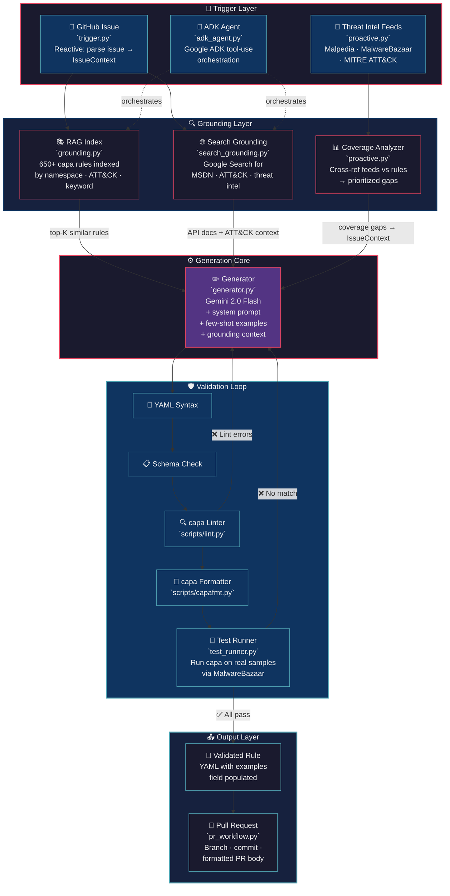
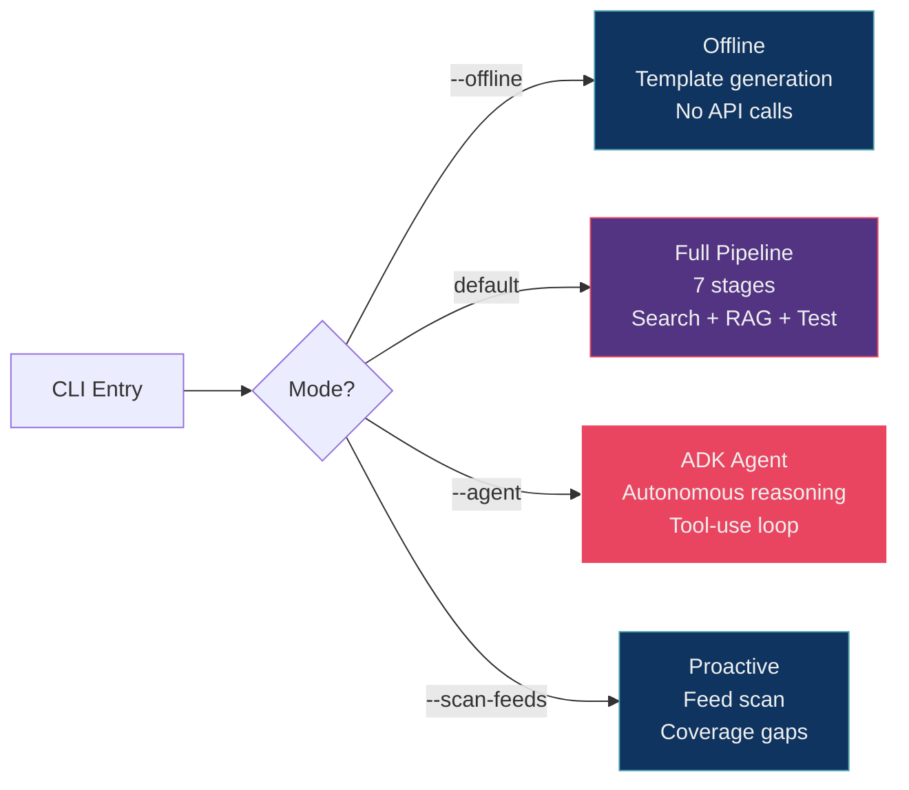

# capa Rule Generation Agent

An autonomous agent that generates, validates, and submits [capa](https://github.com/mandiant/capa) rules from GitHub issues and threat intelligence feeds. Built as a GSoC 2026 proposal demonstrator for Mandiant FLARE.

[](https://github.com/reyyanxahmed/capa-rule-agent/actions)

## System Architecture



## Deliverables Mapping

This implementation maps to the four GSoC deliverables:

| # | Deliverable | Module(s) | Status |
|---|-------------|-----------|--------|
| 1 | **Agent Core & Triggers** — Google ADK agent with reactive (GitHub Issues) and proactive (daily feeds) triggers | `adk_agent.py`, `trigger.py`, `proactive.py` | ✅ Implemented |
| 2 | **Generation & Grounding** — LLM integration with RAG and Google Search verification | `generator.py`, `grounding.py`, `search_grounding.py` | ✅ Implemented |
| 3 | **Validation Loop** — Self-correction loop with linter, formatter, and sample-based testing | `validator.py`, `test_runner.py` | ✅ Implemented |
| 4 | **Automated PR Workflow** — Branch creation, formatted PR submission with test results | `pr_workflow.py` | ✅ Implemented |

## Components

| Module | File | Lines | Description |
|--------|------|-------|-------------|
| **Trigger** | `src/trigger.py` | 236 | Parses capa-rules GitHub issues → structured `IssueContext` (ATT&CK IDs, hashes, refs, decompilation) |
| **Proactive** | `src/proactive.py` | 340+ | Scans MALPEDIA, MalwareBazaar, MITRE ATT&CK for coverage gaps; `CoverageAnalyzer` cross-references feeds with existing rules |
| **RAG Grounding** | `src/grounding.py` | 288 | Inverted index over 650+ capa rules; retrieves top-K by namespace, ATT&CK ID, keyword |
| **Search Grounding** | `src/search_grounding.py` | 310+ | Google Search for MSDN API docs, registry paths, ATT&CK technique details; prevents hallucinated API names |
| **Generator** | `src/generator.py` | 301 | Gemini 2.0 Flash with system prompt (capa format spec) + few-shot examples + dual grounding context |
| **Validator** | `src/validator.py` | 275 | Multi-stage: YAML syntax → schema → `capa lint` → `capafmt` |
| **Test Runner** | `src/test_runner.py` | 300+ | Run capa on real samples (local or MalwareBazaar download); populate `examples:` field from matches |
| **PR Workflow** | `src/pr_workflow.py` | 290+ | Git branch management, rule file placement, formatted PR body with validation table, `gh` CLI integration |
| **ADK Agent** | `src/adk_agent.py` | 400+ | Google ADK agent with 6 tool declarations, agentic reasoning loop, function calling, conversation history |
| **Pipeline** | `src/pipeline.py` | 350+ | Orchestrates all modules; supports offline, standard, full, and agent execution modes |

## Quick Start

```bash
# Clone with capa-rules for grounding
git clone https://github.com/mandiant/capa-rules.git ../capa-rules

# Install dependencies
pip install -r requirements.txt

# ── Standard pipeline (Gemini API) ──
export GOOGLE_API_KEY="your-key-here"
python -m src.pipeline --issue-url https://github.com/mandiant/capa-rules/issues/1114

# ── Offline mode (template generation, no API) ──
python -m src.pipeline --description "Detect persistence via ShellServiceObjectDelayLoad" --offline

# ── Full pipeline with testing + PR submission ──
python -m src.pipeline --issue-url https://github.com/mandiant/capa-rules/issues/1114 \
  --submit-pr --sample-dir ./samples/

# ── ADK Agent mode (autonomous tool-use reasoning) ──
python -m src.pipeline --agent --issue-url https://github.com/mandiant/capa-rules/issues/1114

# ── Proactive feed scan (find coverage gaps) ──
python -m src.pipeline --scan-feeds --rules-dir ../capa-rules
```

## Execution Modes



## Pipeline Stages (Full Mode)

```
Stage 1: RAG Grounding       → Index 650+ rules, retrieve top-5 similar
Stage 2: Search Grounding    → Google Search for API docs + ATT&CK details
Stage 3: LLM Generation      → Gemini 2.0 Flash with dual grounding context
Stage 4: Validation           → YAML → Schema → capa lint → capafmt
Stage 5: Self-Correction      → Parse errors, re-prompt LLM (up to 3 attempts)
Stage 6: Sample Testing       → Run capa on samples, inject examples field
Stage 7: PR Submission        → Branch, commit, push, create PR via gh CLI
```

## Agent Tool-Use Architecture (ADK Mode)

The ADK agent wraps the pipeline as a set of tools that Gemini can invoke via function calling:

| Tool | Purpose | Maps To |
|------|---------|---------|
| `parse_issue` | Extract structured context from a GitHub issue URL | `trigger.py` |
| `search_similar_rules` | RAG retrieval over capa-rules corpus | `grounding.py` |
| `search_api_docs` | Google Search for Win32 API / ATT&CK verification | `search_grounding.py` |
| `validate_rule` | Full YAML → schema → lint → format pipeline | `validator.py` |
| `run_capa_test` | Run capa on a real sample to verify detection | `test_runner.py` |
| `create_pr` | Submit validated rule as a Pull Request | `pr_workflow.py` |

The agent autonomously decides which tools to call, in what order, based on the issue context. Typical agent trace:

```
Round 1: parse_issue(issue_url="...#1114")        → extracts ATT&CK IDs, refs, hashes
Round 2: search_similar_rules(query="...", ...)    → retrieves 5 similar rules
         search_api_docs(query="RegSetValueEx")    → verifies API exists
Round 3: [model generates rule using tool results]
Round 4: validate_rule(rule_text="...")            → YAML ✅, Schema ✅, Lint ❌
Round 5: [model fixes lint errors, regenerates]
Round 6: validate_rule(rule_text="...")            → All ✅
Round 7: run_capa_test(rule_text="...", hash="…")  → MATCH at 0x401130
Round 8: create_pr(rule_text="...", ...)           → PR #1127 created
```

## Demo: RAG Grounding in Action

When given the query "Detect persistence via Windows service creation T1543.003", the grounding module retrieves:

```
Top 5 results for 'Windows service persistence':
  [12.5] persistence/service/persist via Windows service
  [ 6.5] persistence/service/persist via rc script
  [ 6.0] host-interaction/service/continue service
  [ 6.0] host-interaction/service/create/create service
  [ 6.0] host-interaction/service/delete/delete service
```

These real rules are injected into the LLM prompt as few-shot examples, ensuring generated rules follow the exact capa syntax and style conventions.

## Proactive Trigger: Coverage Gap Detection

The proactive trigger scans three threat intel sources and cross-references with existing capa rules:

```
$ python -m src.pipeline --scan-feeds --rules-dir ../capa-rules

============================================================
COVERAGE GAPS (12 found)
============================================================
  [no_coverage] T1055.012: Process Hollowing (priority: 11.0, sources: 1, existing_rules: 0)
  [no_coverage] T1027.002: Software Packing (priority: 10.0, sources: 0, existing_rules: 0)
  [partial_coverage] T1547.001: Registry Run Keys (priority: 6.5, sources: 3, existing_rules: 1)
  ...
```

## Example Output

See `examples/` for generated rules. Here's a sample for [issue #1114](https://github.com/mandiant/capa-rules/issues/1114):

```yaml
rule:
  meta:
    name: persist via ShellServiceObjectDelayLoad
    namespace: persistence/registry
    authors:
      - gsoc-agent@mandiant.com
    scopes:
      static: function
      dynamic: span of calls
    att&ck:
      - Persistence::Boot or Logon Autostart Execution::Registry Run Keys / Startup Folder [T1547.001]
    references:
      - https://blog.virustotal.com/2024/03/com-objects-hijacking.html
  features:
    - and:
      - or:
        - match: set registry value
        - number: 0x80000002 = HKEY_LOCAL_MACHINE
      - string: /Software\\Microsoft\\Windows\\CurrentVersion\\ShellServiceObjectDelayLoad/i
```

## Testing

```bash
# Run all tests
python -m pytest tests/ -v

# Unit tests only (original)
python -m pytest tests/test_agent.py -v

# Expanded module tests (proactive, search, PR, test runner, ADK)
python -m pytest tests/test_expanded.py -v

# Integration tests (requires capa-rules clone at ../capa-rules)
python -m pytest tests/test_integration.py -v
```

## Project Structure

```
capa-rule-agent/
├── src/
│   ├── __init__.py
│   ├── __main__.py          # CLI entry: python -m src
│   ├── pipeline.py           # Orchestrator — 4 execution modes
│   ├── trigger.py            # Reactive trigger (GitHub issues)
│   ├── proactive.py          # Proactive trigger (Malpedia, MalwareBazaar, ATT&CK)
│   ├── grounding.py          # RAG index over 650+ capa rules
│   ├── search_grounding.py   # Google Search for API/ATT&CK verification
│   ├── generator.py          # Gemini-powered rule generation
│   ├── validator.py          # YAML → schema → lint → format pipeline
│   ├── test_runner.py        # capa execution against real samples
│   ├── pr_workflow.py        # Automated PR creation via gh CLI
│   └── adk_agent.py          # Google ADK agent with tool-use
├── tests/
│   ├── test_agent.py         # Unit tests (trigger, validator, generator, grounding)
│   ├── test_expanded.py      # Tests for expanded modules
│   └── test_integration.py   # Integration tests against real capa-rules
├── examples/
│   ├── shellserviceobjectdelayload.yml
│   └── detect-bits-usage.yml
├── .github/workflows/ci.yml  # CI with Python 3.11/3.12 matrix
├── requirements.txt
└── README.md
```

## How It Works

1. **Trigger** — Parse a GitHub issue (reactive) or scan threat intel feeds (proactive) to identify what rule to create
2. **RAG Grounding** — Index 650+ existing capa rules → retrieve top-K most similar as few-shot examples
3. **Search Grounding** — Google Search to verify Win32 API names, registry paths, ATT&CK technique details
4. **Generate** — Prompt Gemini 2.0 Flash with system instruction + RAG examples + search context + issue details
5. **Validate** — Run `capa lint` and `capafmt` against the generated rule
6. **Self-Correct** — If validation fails, parse error messages and re-prompt with specific fix instructions (up to 3 attempts)
7. **Test** — Run capa against real malware samples to verify the rule matches; populate `examples:` field
8. **Submit PR** — Create a properly structured Pull Request with validation table, ATT&CK coverage, and test results

## Human-in-the-Loop (HITL) Philosophy

The agent automates the engineering and testing, but **human maintainers retain full control**:
- Every rule is submitted as a PR, never merged automatically
- Validation results and test output are included in the PR description
- The PR references the source issue for traceability
- Maintainers can request changes, and the agent can iterate

## Tech Stack

- **LLM**: Gemini 2.0 Flash (via `google-genai` SDK)
- **Agent Framework**: Google ADK with function calling
- **RAG**: Custom inverted index (namespace, ATT&CK, keyword)
- **Search**: Google Custom Search API with MSDN/ATT&CK targeting
- **Validation**: capa's official `lint.py` + `capafmt.py`
- **Testing**: capa CLI with `--json` output parsing
- **PR Automation**: GitHub CLI (`gh`) for branch/PR management
- **Threat Intel**: MALPEDIA API, MalwareBazaar API, MITRE ATT&CK STIX
- **CI**: GitHub Actions with Python 3.11/3.12 matrix
